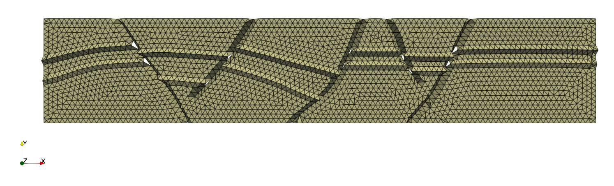
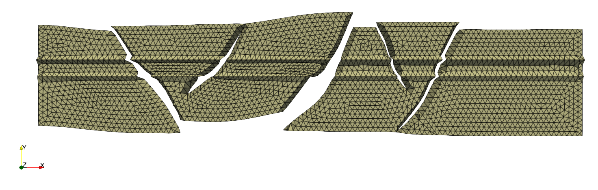
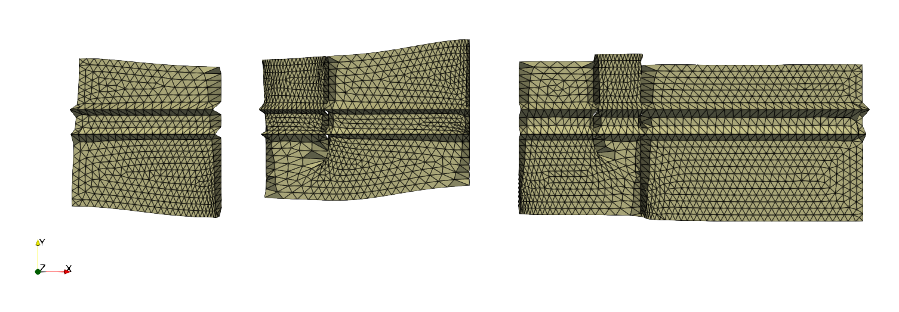
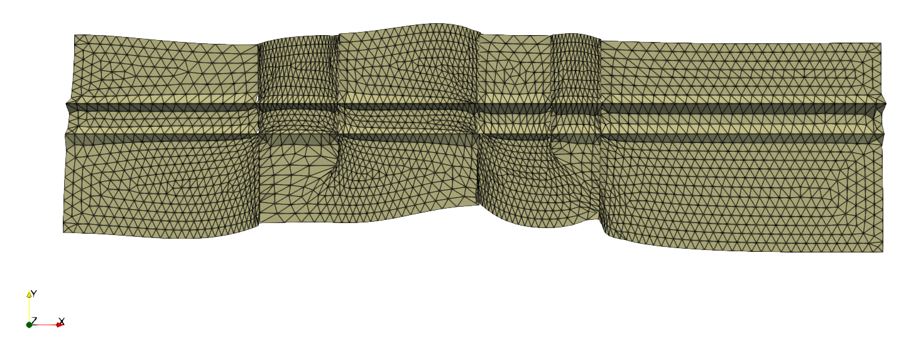
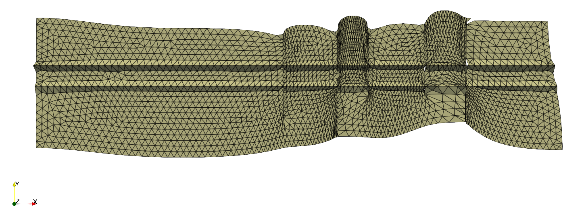
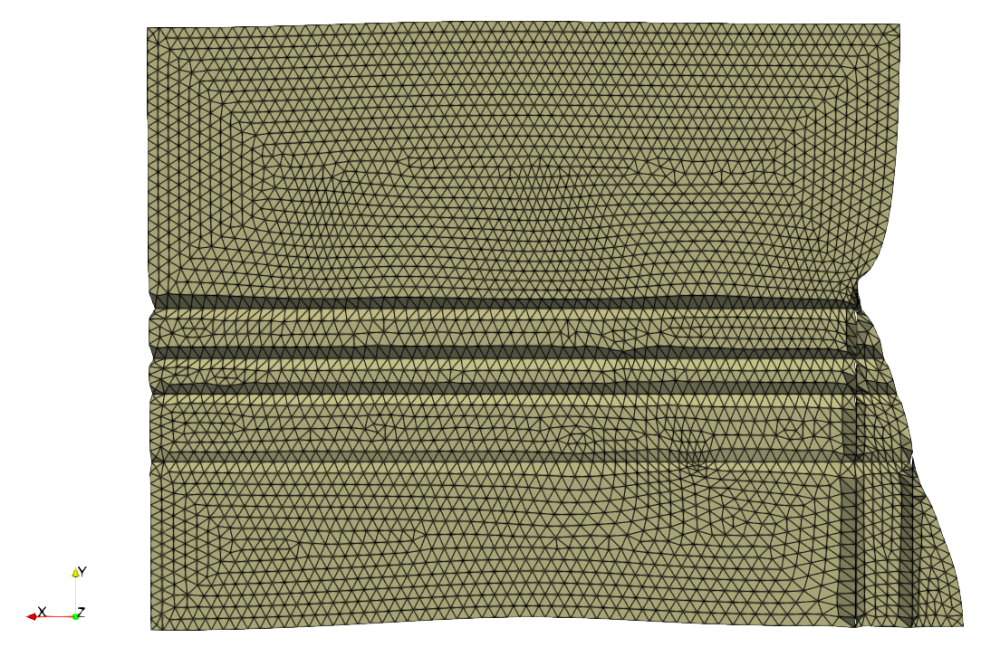
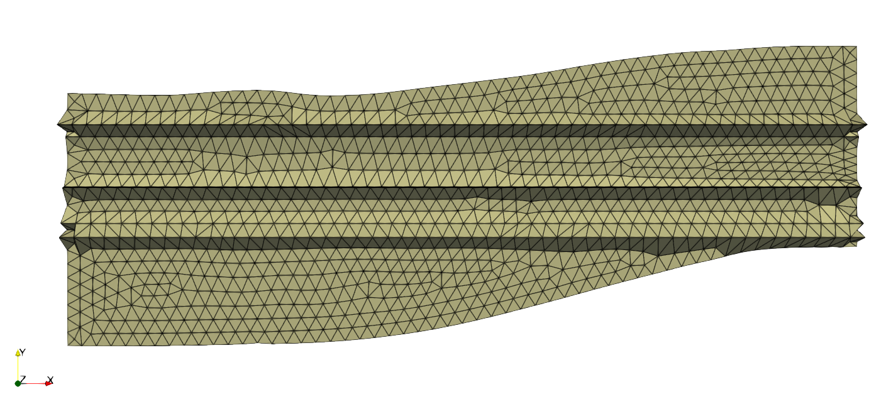

# SalaMesh 
## Overview
**A python geological mesh software to verticalize and horizontalize faults and horizons.**
This work is based on the [least squares lecture of Dmitri Sokolov](https://github.com/ssloy/least-squares-course).
The work is done is described in the [following repository](https://github.com/ssloy/ENSG.git).
See [main](main.py) for more details.

### Meshes
There are foud geological slices called [chevron](chevron), [ifp1](ifp1), [ifp2](ifp2) and [shell](shell).
These slices describe a 2D geological model having zero or more faults and some horizons.
Each mesh has different object files describing either the slice, the horizons or the set of faults.
Slices can have different connex components.
The attributes.py files contains preprocessed data about horizon's and fault's edges.
Mesh class is coded in [mesh.py](mesh.py).

## General scheme
We processed the mesh using the following scheme, for each dimension (x, y):
1. Load the mesh
2. Constructs containers for horizon's and fault's edges
3. Beautify triangles while keeping the original shape
4. Horizontalize geological stratifications / verticalize faults
5. Write output mesh

## Least squares
Editing the mesh amounts to minimizing energy functions. Hence we use least square's formulation for our problem.
In our work, we mainly:
- Optimized the triangles using Poisson's equation
- Minimized distance between some verticie's positions (for faults and horizons)
- Lower / raise verticies (for visualisation purposes)

### Poisson's probem
First the mesh has to be smoothed in order to show regular triangles.
For this, Poisson's equation has been implemented. 
We minimized the difference of distances between the current edge lenght and the processed one. It was done for the x, and y coordinates.

### Constraints
#### On horizons
##### Horizontalizing geological layers
In order to make a geological horizon flat, the y-coordinate variation between the origin vertice and a reference point belonging to this geological  vertices for eatch edge was minimized. The process has been repeated for each horizon, leading to the following result:

#### On faults
##### Verticalizing faults
Concerning the fault, the aim is to minimize the x coordinate variation between the orign and destination vertices for each edge of the fault. With this condition the faults were verticalized.

##### Joining connexe components
An other condition must be added to prevent the connexe component from spliting. The connexe components were joined by minimizing the x distance between an edge and its opposite, the same was done for the y coordinate.

By applying together the minimisations mentioned above, the following results are obtained: 
###### ifp1

###### ifp2

###### chevron

###### shell

## Conclusion

